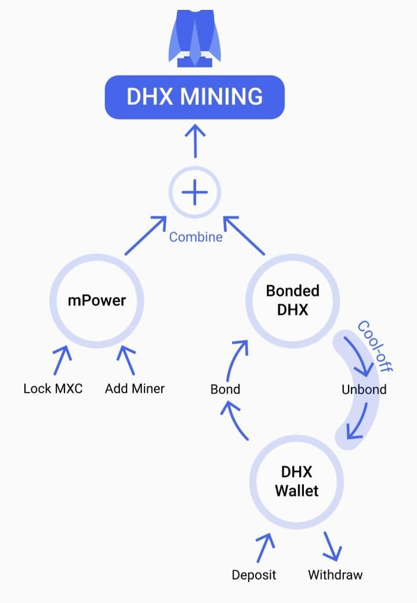

# DHX
Previous announcement:
*DHX has given MXC holders the right to premine DHX. This will be performed on the DataDash Crypto App, where anyone can stake, mine and earn tokens.*

DHX is officially life now and can be traded on biki.cc!

## What is DHX?
DHX or DataHighway is a DAO, **a decentralised autonomous organisation**, the promotion or management does not have a dedicated team of people. Anyone who is qualified and interested in DHX can take part in it. It regulates itself with its own senate and own rules. There is a voting process for example to increase spending or to list on an exchange. Similarly to politics, one person has a vote in DHX. Blockchain and DataHighway gives people the vote and that’s through the DHX token.

## How can I mine DHX?
You need to **download the Data Dash App**. Then you can look for the DHX icon in the DataDash App. Add DHX and get started. **You can then lock your MXC / bond your DHX in order to earn DHX.** Like illustrated in the picture below:

*UPDATE : From now you can also bond DHX to mine DHX!*

### How do I lock MXC?
1. In DataDash click on “wallet” 
2. Click DHX 
3. Click MINE 
4. Click NEW MINING 
5. Read through (or skip) 
6. Select lock (Eg 12 months) 
7. Select Lock Amount 
8. Select a council from the list (completely your choice) Proceed and you’re done.

## How do I calculate my return?
*The most DHX you can mine per day with 35 DHX bonded (for example), is 0.5 DHX. The rule is:  Divide your bonded DHX by 70. That’s the max per day of DHX that you can mine. (Currently, 26th April 2021)*

HOWEVER, to reach that level, you need around 9,000 “mPower” per DHX bonded.
The way to calculate mPower generally is:
- With NO miner, 1 MXC = 1 mPower.
- WITH a miner, 1 MXC = 2 mPower.

So with 35 bonded DHX, and no miner, you would need 35*9,000 = 315,000 mPower. (NOTE: You can increase mPower also by choosing longer MXC “locking” periods, e.g. 12 or 24 months.)

## Some additional notes on DHX mining:
- The above “With a miner” mPower rule only works up to 1 million mPower. To keep the 1 MXC = 2 mPower valid above 1 million mPower, you will need an additional miner. That’s also true at 2M mPower, 3M mPower, etc, with an additional miner needed at each level.
- The 1 MXC = 1 or 2 mPower above can also be improved by locking your MXC for longer periods.
- The above 9,000 mPower per DHX is currently growing by a couple or few hundred each day, as more and more people are mining DHX. 
- There is a combined maximum of **5,000 DHX** that can be mined by everyone each day.

## Does my M2 Pro mine DHX?
An added incentive for people who have the DataDash App and have already purchased the M2 Pro Miner is that they can use this **M2 Pro as a mining booster** — 1mil MXC and 1 M2 pro is a 2 m-Power boost — next m-power boost level is 2mil MXC and 2 M2 Pro = 4 m-power boost. You can purchase an M2 Pro at MatchX.

[Source](https://jessica-86960.medium.com/mxc-holders-given-the-chance-to-premine-dhx-for-free-e885fea30263)