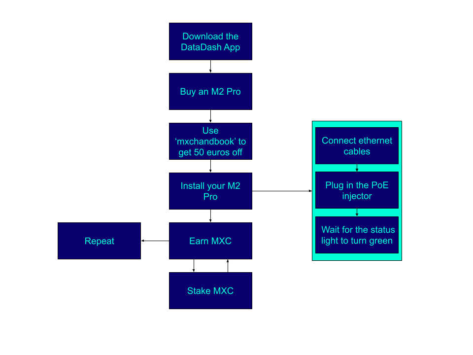

# The MXC handbook

Hello there! Welcome to the MXC handbook.
This will guide you thru all steps, questions and answers you need to get started!

## What is MXC?
MXC is an **ERC20 utility token** used for device transactions conducted through the MXC Supernode network. MXC adds value by giving the MXC community a chance to share in Supernode profits through staking.

This is a great video from MXC explaining the protocol: 
[MXProtocol Explained](https://www.youtube.com/watch?v=26mYsNw32YM)

## Why MXC Works
This table shows the difference between the different iot projects.

| Technology | MXC | IOTA | Streamr | Helium
| - | - | - | - | - |
| Tx Speed | within 5s | minutes to hours | minutees to hours | within 5s |
| Inter-chain data | Yes | No | No | No |
| Anti-collision | Yes | No | No | No |
| Target group | Small devices to   large machines | Powerful machines | Small devices to   large machines | Small Devices|
| USP | MXProtocol | Tangle | Data market | LongFi |
| Totoal Supply | 2,642,132,373 MXC | 2,779,530,283 MIOTA | 987,154,514 DATA (100% Circulating) | 223,000,000 (34% Circulating) |

### IOT Protocols
| Technology | LPWAN | 3G/4G/5G NB-IoT | Wi-Fi |
| - | - | - | - |
| Network topology | Decrentralised star network | Centralized star network | Decentralised star network |
| Target group | All the industries | All the industries | End consumers |
| Maximum range | 40km | 10km | 200m |
| Single cell capacity | more than 60k | around 10k | less than 200 |
| Batery life on AAA | 5 years | 6 months | 3 months |
| Licensend operation | No | Yes | No |
| GPS-free localisation | Yes | Yes | No |

## MXC is listed on a few exchanges
Check them out on one of these sites:
 [coingecko](https://www.coingecko.com/en/coins/mxc#markets)
 [coinmarketcap](https://coinmarketcap.com/currencies/mxc/markets/)

## MXC can be 'mined' using the M2 Pro miner

 press to open youtube

## How do I boost my earnings with the M2 Pro?
Check [this](https://medium.com/mxc/insider-report-how-to-improve-your-m2-pro-mining-earnings-whats-next-4569fc931ac4) article by Simon

## Download the DataDash app to get started
📱 https://www.mxc.org/mxcdatadash

## Connect with the team and community

Probably the best way to get in contact with the community is using <a href="https://t.me/mxcfoundation">the Telegram group</a>

Need technical support from the team, you should checkout <a href="https://discord.com/invite/4vrJyhXs">the Discord server</a>

Want to stay up-to-date? 
[Twitter](https://twitter.com/MXCfoundation)
[Medium](https://medium.com/mxc)

## Start mining
Mining is easy! This diagram should describe it as simple as possible:

## Where does the money go?

## RoadMap

## The team

## Data Economy in short

