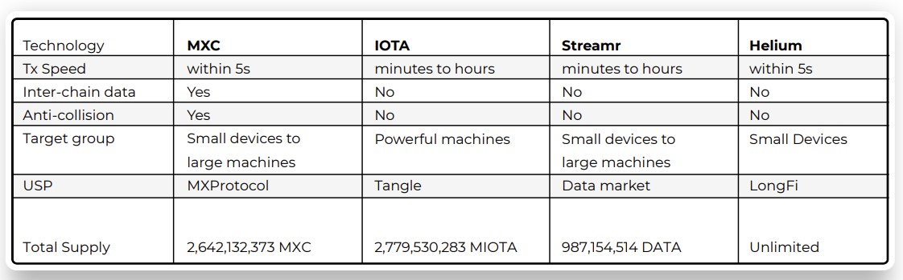
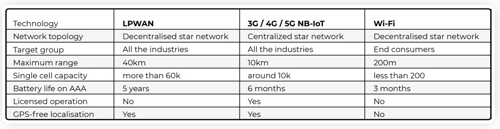

# The MXC handbook

Hello there! Welcome to the MXC handbook.
This will guide you thru all steps, questions and answers you need to get started!

## What is MXC?

MXC is an ERC20 utility token used for device transactions conducted through the MXC Supernode network. MXC adds value by giving the MXC community a chance to share in Supernode profits through staking.

This is a great video from MXC explaining the protocol: 
<a href="https://www.youtube.com/watch?v=26mYsNw32YM">MXProtocol Explained</a> 

## Why MXC Works
This table shows the difference between the different iot projects.

### IOT Protocols

## MXC is listed on a few exchanges
Check them out on one of these sites:

<a href="https://www.coingecko.com/en/coins/mxc#markets">coingecko</a> 
<a href="https://coinmarketcap.com/currencies/mxc/markets/">coinmarketcap</a>

## MXC can be 'mined' using the M2 Pro miner
<a href="https://www.youtube.com/watch?v=2nOUdLNJVtU&t">How to install the M2 Pro in 4 minutes by Matchx</a> 

## Download the DataDash app to get started
📱 https://www.mxc.org/mxcdatadash

## Connect with the team and community

Probably the best way to get in contact with the community is using <a href="https://t.me/mxcfoundation">the Telegram group</a>

Need technical support from the team, you should checkout <a href="https://discord.com/invite/4vrJyhXs">the Discord server</a>

Want to stay up-to-date? 
<a href="https://twitter.com/MXCfoundation">Twitter</a>
<a href="https://medium.com/mxc">Medium</a>

## Start mining

Mining is easy! This diagram should describe it as simple as possible:

## Where does the money go?

## RoadMap

## The team

## Data Economy in short

## M2 Pro User Guide

This is the M2 Pro's user guide, it contains all info you need about the hardware!

